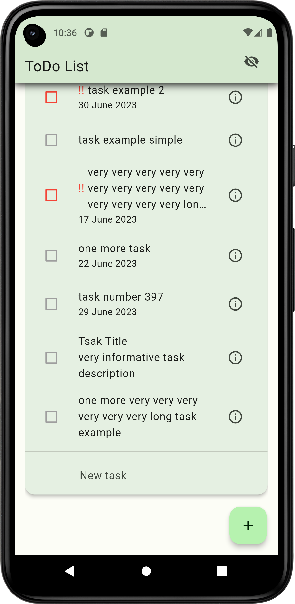
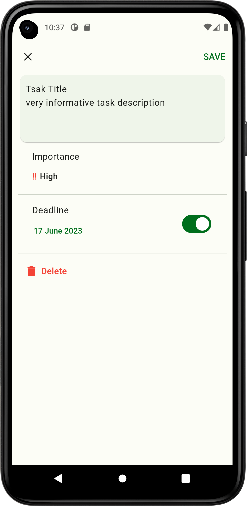

# ToDo List App

A simple Flutter ToDo list implementation. For now, only Android version is supported.

## Description

With this application you can easily create tasks, choose priority for each task, and set a deadline.

## List of features

* Managing your tasks
  * Creating
  * Editing
  * Marking as done
  * Removing
* Set a priority for tasks
* Set a deadline for tasks
* [Google Material 3 design](https://m3.material.io/)
* Smooth animations
* Saving tasks in phone storage
* Adaptive light and dark themes
* Dynamic colors (available from Android S+)
* Adaptive language (english and russian are supported)

## Technologies and materials used

* [Dart programming language](https://dart.dev)
* [Flutter framework](https://flutter.dev)
* Different flutter libraries. List available at [pubspec.yaml](https://github.com/vladdan16/todo_list/blob/master/pubspec.yaml) file

## Demonstration

<p>Home page with tasks:</p>
<p float="left">
 
</p>
<p>Home page with tasks and collapsed AppBar:</p>
<p float="left">
 
</p>
<p>Adding and editing task page:</p>
<p float="left">
 
</p>

## Android release
You can try ToLo List right now! Just install `.apk` file by [this link](https://1drv.ms/u/s!ArdUz65lrqPeheJGOPz0Hor4dlZOTw?e=4W2HyL).

## Project installation and run

Before start be sure that you have installed git, [Flutter](https://flutter.dev) sdk and `dart` and `flutter` commands are added to path.

1. Clone the repository
```console
git clone git@github.com:vladdan16/todo_list.git
```

2. Go to the root directory of the project
```console
cd todo_list
```

3. Get all dependencies
```console
dart pub get
```

4. Run project
```console
flutter run
```
